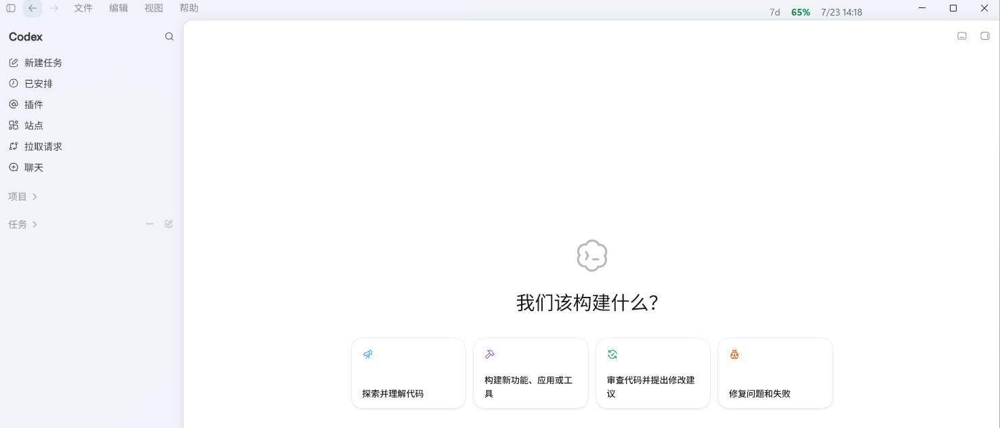

<div align="center">

# Codex TitleBar

A lightweight Windows utility that shows remaining quota and reset time in the Codex Desktop title bar

[中文](README.md) | English

[](https://www.microsoft.com/windows)
[](https://learn.microsoft.com/powershell/)
[](#requirements)

</div>

Codex TitleBar is a local companion utility for Codex Desktop on Windows. It displays the current remaining quota percentage and reset time on the right side of the Codex title bar, so you can check quota status without leaving your current task.

The utility is built with PowerShell, WPF, and the Windows API. It contains no precompiled third-party executables, does not modify the Codex installation, and does not collect conversation content.

This project was created primarily for personal use and is shared as source code for people with similar needs. Behavior may vary across Codex versions, account types, and network environments.

## Demo



Quota information appears directly in the top-right corner of the Codex window and blends into the application title bar, with no separate window to manage.

## Motivation

This utility was created for two main reasons:

1. **Remaining quota is not always obvious in Codex.** The existing entry points are not prominent enough for a quick check during active work.
2. **Many existing tools run as separate applications.** A standalone window or dashboard takes additional space and requires switching away from Codex. Showing the information directly in the Codex Desktop title bar is simpler and more immediate.

The project therefore focuses on one task: placing the most useful quota information directly in the Codex window with as little overhead and distraction as possible.

## Features

- **Title-bar display:** shows remaining quota and reset time at the top of Codex Desktop.
- **Multiple quota windows:** supports the current weekly (`7d`) window and accounts that still return a five-hour (`5h`) window.
- **Window tracking:** follows Codex when it moves, minimizes, restores, or recreates its main window.
- **Asynchronous refresh:** refreshes every 30 seconds without blocking the interface and retries more quickly after network failures.
- **Jump protection:** filters occasional incorrect quota snapshots that would otherwise make the value jump upward unexpectedly.
- **System tray controls:** provides manual refresh and exit actions.
- **Single-instance behavior:** prevents duplicate overlays and watchers.
- **Lightweight and transparent:** requires no SDK, npm package, or additional executable.

## Display Format

The title bar uses one of the following layouts, depending on the quota windows returned by the service:

```text
7d  82%  7/20 14:30
```

```text
5h  64%  18:20  |  7d  82%  7/20 14:30
```

- The percentage represents **remaining quota**, not quota already used.
- `5h` shows the local reset time for the short window.
- `7d` shows the local reset date and time for the weekly window.
- API-key pay-as-you-go mode has no subscription quota window, so it is displayed as `7d --`.

## Requirements

- Windows 10 or Windows 11
- Codex Desktop from the Microsoft Store/MSIX package
- Windows PowerShell 5.1
- A ChatGPT subscription account signed in through Codex Desktop

> [!NOTE]
> The current window detection logic matches the `OpenAI.Codex_*` application package path. Other installation formats may not be detected automatically.

## Quick Start

### Option 1: Let Codex Set It Up (Recommended)

Send the following English prompt to Codex to download the project, check the environment, and configure startup:

```text
Set up Codex TitleBar on this Windows PC from https://github.com/yichen-kami/Codex-TitleBar. If the repository is not already available in the current workspace, ask me where I want it cloned before downloading anything. Read the README first and use the scripts included in the repository. Verify that Windows PowerShell 5.1 and the Microsoft Store/MSIX version of Codex Desktop are available. Do not modify the Codex installation, app.asar, or any authentication file. Preserve any existing proxy configuration in %USERPROFILE%\.codex\.env and do not add a proxy unless I explicitly request one. Ask before replacing an existing scheduled task. Configure the current-user scheduled task CodexQuotaTitlebarWatcher to run CodexQuotaLauncher.vbs at sign-in, start the watcher, verify that the quota display appears in the Codex title bar, and then summarize every system change you made.
```

The prompt tells Codex to retain confirmation steps before downloading files, replacing a scheduled task, or making relevant system changes. It also prevents changes to the Codex application and authentication files.

### Option 2: Manual Setup

#### 1. Download the project

Choose **Code → Download ZIP** on GitHub and extract it, or use Git:

```powershell
git clone https://github.com/yichen-kami/Codex-TitleBar.git
cd Codex-TitleBar
```

#### 2. Start the title-bar display

Double-click:

```text
启动 Codex 额度条.cmd
```

Or run it from PowerShell:

```powershell
powershell.exe -NoProfile -ExecutionPolicy Bypass -STA -File .\CodexQuotaTitlebar.ps1
```

If Codex is not running yet, the overlay waits in the background and appears when the main Codex window becomes available.

## Start Automatically with Codex

`CodexQuotaWatcher.ps1` continuously watches for Codex Desktop:

1. It starts the title-bar display when Codex launches.
2. It restores the display if the companion process exits unexpectedly.
3. It cleans up after Codex closes and waits for the next launch.

Double-click `CodexQuotaStartup.cmd` to start the watcher silently for the current session. To run it after Windows sign-in, create a current-user logon trigger in Task Scheduler, set the program to:

```text
wscript.exe
```

Use the full path to `CodexQuotaLauncher.vbs` as the argument. The launcher locates the watcher relative to its own directory, so the project can be stored anywhere.

## Data Source and Refresh Behavior

The utility reads the existing Codex sign-in state from `%USERPROFILE%\.codex\auth.json` and requests the quota endpoint used by Codex/ChatGPT:

```text
GET https://chatgpt.com/backend-api/wham/usage
```

- Quota windows are identified by `limit_window_seconds`.
- When the API returns `used_percent`, remaining quota is calculated as `100 - used_percent`.
- UTC/Unix reset timestamps are converted to Windows local time.
- The normal refresh interval is 30 seconds; failed requests retry every 10 seconds.
- Temporary network failures retain the last valid result until the known quota window reaches its reset time.
- Expired sign-in state, missing valid data, or an unsupported response format is displayed as `--`.

> [!WARNING]
> This endpoint is not a public API with a long-term stability guarantee for third-party tools. Changes to Codex Desktop or the server response may require updates to this project.

## Upward-Jump Protection

Quota decreases and unchanged values are applied immediately. If the service suddenly reports a higher value before the known reset time, the utility waits for two consecutive identical results before accepting it. A genuinely reset window is accepted immediately.

This filters occasional temporary `98%` or `99%` snapshots without hiding real usage or normal resets.

## Proxy Configuration

The utility first reads `HTTPS_PROXY` from `%USERPROFILE%\.codex\.env`, then falls back to `HTTP_PROXY`:

```dotenv
HTTPS_PROXY=<your-proxy-url>
```

A local HTTP proxy is commonly written as `http://127.0.0.1:<port>`. Replace the protocol, address, and port with the values used by your own proxy client. Proxy software and user environments differ, so this project does not assume a fixed port.

If your network can access the service directly, you do not need to create or modify `.codex\.env`. Without an explicit proxy, the utility uses the default Windows/.NET network configuration.

## Project Structure

| File | Purpose |
| --- | --- |
| `CodexQuotaTitlebar.ps1` | Main program: quota request and parsing, WPF interface, Win32 window tracking, and lifecycle management. |
| `CodexQuotaWatcher.ps1` | Watches the Codex process and starts, waits for, or restores the title-bar companion. |
| `CodexQuotaLauncher.vbs` | Hidden launcher suitable for Task Scheduler. |
| `CodexQuotaStartup.cmd` | Shortcut for starting the watcher silently. |
| `启动 Codex 额度条.cmd` | Direct manual launch shortcut. |
| `assets/codex-titlebar-demo.png` | Runtime screenshot used in the documentation. |
| `README.md` | Chinese documentation. |
| `README_EN.md` | English documentation. |

## Privacy and Security

- The access token is used only in memory by the current PowerShell process to request `chatgpt.com`.
- Access tokens, refresh tokens, cookies, and complete account IDs are not printed, saved, or uploaded.
- Conversation history, task content, prompts, and local source files are not collected.
- The project contains no telemetry, analytics, or third-party tracking.
- It does not modify Codex `app.asar`, the installation directory, configuration, or account quota.

Always review third-party scripts that access a sign-in token before running them. All executable project code is available as readable PowerShell, VBS, and CMD source files in this repository.

## Troubleshooting

### Nothing appears after launch

Check that:

1. Codex Desktop is running and signed in.
2. You are using the supported Microsoft Store/MSIX version.
3. Windows security policy has not blocked `CodexQuotaTitlebar.ps1`.
4. The `Codex Quota Titlebar` icon appears in the system tray.

### The display shows `7d --`

Common causes include API-key pay-as-you-go mode, expired sign-in state, a temporary network problem, or a quota response format that is not yet supported.

### How do I exit?

Right-click `Codex Quota Titlebar` in the system tray and choose **Exit**. If the watcher is still running, it will restart the title-bar display automatically. To stop it completely, also end the PowerShell process running `CodexQuotaWatcher.ps1`.

## Disable Automatic Start and Uninstall

If you created the scheduled task yourself, remove it from PowerShell:

```powershell
Unregister-ScheduledTask -TaskName 'CodexQuotaTitlebarWatcher' -Confirm:$false
```

Then stop the title-bar and watcher processes and delete the project directory. The project does not modify or remove Codex configuration or sign-in state.

## Disclaimer

This is a community project and is not affiliated with or endorsed by OpenAI. Codex, ChatGPT, and OpenAI are trademarks of their respective owners.
